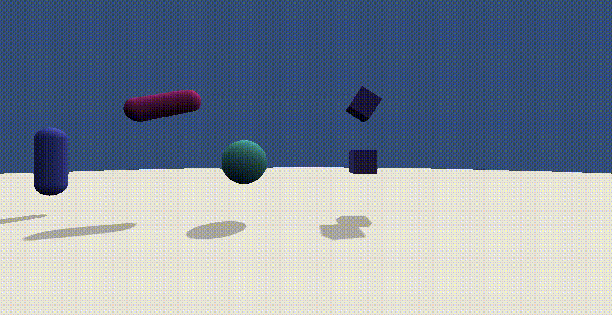

# Into Another Dimension: Developing a Simulation of 4D Space by Implementing 4D Rigid Body Dynamics and Ray Marching

In recent years, scholars and programmers have developed programs that simulate 4D
spaces and allow users to interact with them. Not only do these types of
programs serve as great tools for introducing the concepts behind higher-dimensional
spaces, they also allude to the many possibilities of gamifying these concepts and
incorporating them into other forms of digital entertainment. Nevertheless, despite
their benefits, these types of programs are very difficult to implement in practice
due to the lack of resources and tools available to do so. To serve as a starting point
for the development of such programs, this project provides a working implementation 
of a 4D physics engine and rendering pipeline built with the Unity game engine. 

The files of this project's implementation can be found in the "src" subdirectory 
of this repository. Additionally, the "build" subdirectory contains a build of my
project with an example world setup. Lastly, the "files" subdirectory contains my 
final report and presentation slideshow, both of which served as my senior thesis
for fulfilling the requirements of my undergraduate degree at Princeton University.

# Project Acknowledgements

I would like to express my deepest gratitude to my senior thesis advisor, Dr. Szymon Rusinkiewicz,
for his kind words and helpful guidance throughout this project. I would also like to
thank all of my friends and family for motivating me to push forward with this idea
and supporting me throughout this difficult process.